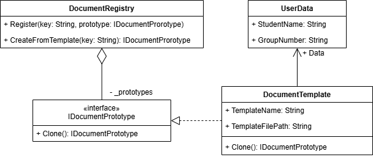

**1. Описание проблемы предметной области**
В университетской практике студенты регулярно готовят отчеты по лабораторным работам, практикам и курсовым проектам, что требует заполнения множества однотипных документов. Ручное создание таких файлов занимает много времени и часто приводит к ошибкам в оформлении или повторяющихся данных студента. Кроме того, разные типы работ имеют схожие данные (ФИО, группа), но используют разные шаблоны документов и специфичные поля. Необходимо автоматизировать процесс генерации, обеспечив гибкость для добавления новых типов отчетов в будущем без переписывания кода.  

**2. Решение: использование паттерна Прототип**
Для решения задачи был применен порождающий паттерн проектирования «Прототип», позволяющий создавать новые объекты документов путем клонирования существующих экземпляров. На рисунке 1 изображены реализованный интерфейс IDocumentPrototype и класс DocumentTemplate, который хранит путь к файлу шаблона и встроенные данные для подстановки, а также специальный реестр DocumentRegistry, который управляет коллекцией прототипов и предоставляет метод для создания независимых копий шаблонов по запросу пользователя. Это позволяет инициировать создание документа на основе заранее настроенного образца, сохраняя его внутреннее состояние изолированным от других экземпляров.  

||
|:--------------------------------------:|
|Рисунок 1|  

**3. Вывод: влияние паттерна на работу программы**
Внедрение паттерна Прототип усложнило архитектуру проекта за счёт введения дополнительных классов, интерфейсов и логики глубокого клонирования. Однако эта сложность оправдана: система стала значительно гибче и готовой к масштабированию без переписывания существующего кода. Добавление новых типов документов теперь сводится к регистрации нового прототипа, а не к изменению логики формы. Каждый сгенерированный документ получает полностью независимую копию данных, что исключает ошибки при одновременной работе с несколькими файлами. Таким образом, паттерн обеспечил лучшую расширяемость и надёжность ценой увеличения начальной сложности кода.