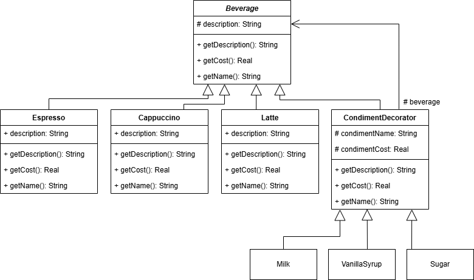

# Лабораторная работа: Разработка системы «Coffee Shop»

## 1. Описание проблемы
Необходимо разработать программную систему для автоматизации заказа напитков в кофейне. Система должна позволять выбирать базовый напиток (эспрессо, латте, чай и др.), добавлять к нему различные ингредиенты (молоко, сахар, сиропы), рассчитывать итоговую стоимость и формировать чек. Основная сложность заключается в том, что количество возможных комбинаций напитков и добавок велико, а цена зависит от конкретного состава заказа.

## 2. Решение: Структура программы
Система реализована на языке C++ с использованием объектно-ориентированного подхода. Архитектура приложения строится на взаимодействии нескольких ключевых классов, описанных в соответствии с стандартом UML 2.5 (Моисеев, Литовченко).

**Основные классы системы:**
*   **Beverage (Напиток)** – базовый класс, описывающий общие свойства всех напитков (имя, описание, стоимость). Содержит виртуальные методы для получения цены и описания.
*   **ConcreteBeverages (Конкретные напитки)** – классы-наследники (Espresso, Latte, Tea и др.), реализующие базовую стоимость и имя конкретного напитка.
*   **CondimentDecorator (Декоратор добавок)** – класс, позволяющий динамически добавлять ответственность объекту. Содержит ссылку на объект напитка и параметры добавки (цена, имя).
*   **ConcreteCondiments (Конкретные добавки)** – классы-наследники декоратора (Milk, Sugar, Syrup и др.), устанавливающие стоимость и название конкретной добавки.
*   **OrderItem (Элемент заказа)** – класс, агрегирующий напиток и список добавок для формирования итогового чека.
*   **BeverageApp (Приложение)** – главный класс, управляющий графическим интерфейсом (SFML), обработкой событий и жизненным циклом объектов.

**Взаимодействие объектов:**
Клиентская часть (`BeverageApp`) работает с объектами через общий интерфейс класса `Beverage`. При добавлении ингредиента создается новый объект-обёртка, который ссылается на предыдущий объект напитка. Расчёт стоимости происходит рекурсивно: каждый объект добавляет свою цену к цене вложенного объекта. Удаление объектов осуществляется автоматически благодаря механизму умных указателей (`unique_ptr`), что гарантирует отсутствие утечек памяти.

## 3. Диаграммы
||
|:--------------------------------------:|
|Рисунок 1. Реализация паттерна|  

||
|:--------------------------------------:|
|Рисунок 2. Конкретный пример возможной иерархии объектов|

## 4. Сравнение подходов
### 4.1 Без использования паттерна
В альтернативной реализации (без динамического оборачивания) данные о напитках и добавках хранятся в статических структурах (базах данных). Расчёт стоимости производится путём прямого перебора списка добавок и суммирования их цен с базовой стоимостью напитка. Объекты не создаются динамически для каждой добавки, что упрощает код, но снижает гибкость расширения поведения.

### 4.2 С использованием текущей реализации
Текущая реализация позволяет комбинировать добавки динамически без изменения кода базовых классов. Каждый новый ингредиент инкапсулирован в отдельном классе. Это упрощает поддержку и тестирование отдельных компонентов системы.

## 5. Вывод
В ходе работы была разработана система заказа напитков, соответствующая требованиям лабораторной работы. Применение объектно-ориентированного подхода позволило:
1.  **Унифицировать интерфейс** – все напитки и добавки обрабатываются через единый базовый класс.
2.  **Обеспечить безопасность памяти** – использование умных указателей исключает утечки ресурсов.
3.  **Упростить расширение** – добавление нового ингредиента требует создания только одного нового класса.
4.  **Визуализировать структуру** – с помощью диаграмм UML (классов и объектов) были отображены статическая структура системы и снимок объектов в момент выполнения заказа.

Система успешно проходит тестирование: корректно рассчитывает стоимость, формирует описание заказа и выводит чек в консоль и файл.