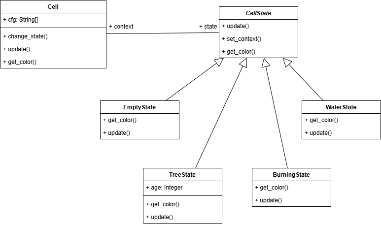
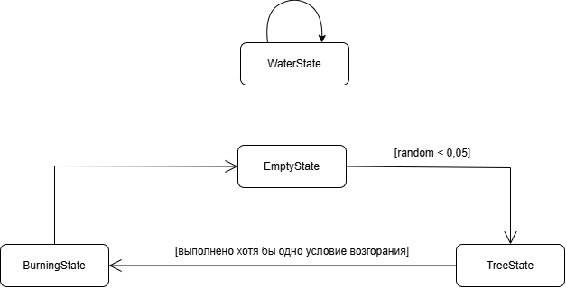

# Документация: Паттерн «Состояние» в симуляции лесного пожара

## Описание проблемы

Требуется симуляция лесного пожара, где каждая клетка может быть: пустой землёй, деревом, горящей или водой. Поведение клетки кардинально зависит от состояния: деревья растут, загораются от соседей (с учётом ветра), от молний и сгорают за тик.

Прямая реализация через `if-elif` привела бы к монолитному коду с жёсткой связностью. Добавление нового состояния (например, «пепелище») потребовало бы переписывания всех условий.

## Решение: Паттерн «Состояние» (State)

**Роли:**
- **Context** (`Cell`) — хранит текущее состояние, делегирует `update()` и `get_color()`, предоставляет `change_state()`.
- **State** (`CellState`) — абстрактный интерфейс с методами `update()`, `set_context()`, `get_color()`.
- **Concrete States** — `EmptyState`, `TreeState`, `BurningState`, `WaterState`.

**Взаимодействие:**
1. Создаётся сетка `Cell` с начальными состояниями.
2. Каждый тик вызывается `cell.update()`, что делегируется текущему состоянию.
3. Состояние решает: остаться или вызвать `context.change_state(NewState())`.
4. Отрисовка через `cell.get_color()` также делегируется состоянию.

## Диаграмма классов

## Диаграмма состояний

## Вывод: влияние внедрения паттерна

**До применения State:**  
Весь код в одном методе с кучей `if cell.type == "tree"` / `elif cell.type == "burning"`. Добавление состояния = правка всех условий.

**После внедрения State:**
- Логика каждого состояния инкапсулирована в отдельном классе.
- Новые состояния добавляются без изменения существующих.
- Контекст `Cell` упростился до делегирования.
- Код стал тестируемым.

**Итог:** паттерн State превратил запутанные условные операторы в чистую архитектуру, где каждое состояние отвечает только за свою логику переходов.