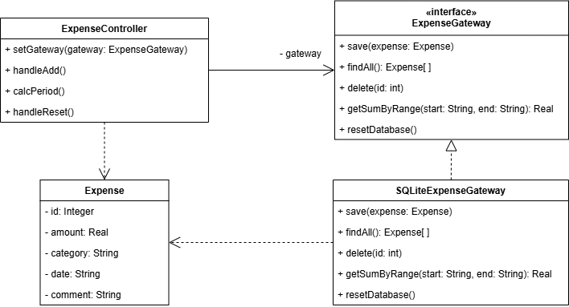

## Предметная область
Система учёта личных расходов (Expense Tracker MVP). Приложение предназначено для добавления, просмотра, фильтрации и анализа финансовых записей (сумма, категория, дата, комментарий) на основе структурированных данных, хранящихся в реляционной базе данных SQLite.

## Проблема
При прямой реализации взаимодействия между пользовательским интерфейсом (`ExpenseController`) и источником данных возникают следующие проблемы:
1. **Громоздкий код**: для работы с БД нужно писать SQL-запросы, обрабатывать `ResultSet` и управлять `Connection`. Это добавляет много шаблонного кода в контроллер.
2. **Нарушение принципа разделения ответственности**: код, отвечающий за отображение данных пользователю, будет зависеть от структуры базы данных (имена таблиц, колонок, типы данных).
3. **Риски при внесении изменений**: если потребуется заменить SQLite на PostgreSQL или подключить облачный API, потребуется масштабный рефакторинг всех модулей, обращающихся к данным.

## Решение
Для решения данной проблемы применён архитектурный паттерн проектирования **«Шлюз» (Gateway)**. В системе реализован интерфейс `ExpenseGateway` и его реализация `SQLiteExpenseGateway`, которые выступают единой точкой входа и полностью инкапсулируют доступ к источнику данных: создание соединений, подготовку запросов, обработку исключений и маппинг результатов.

## Диаграмма классов

## Вывод
Применение паттерна Gateway позволило разделить ответственность между слоями приложения: контроллер работает только с абстракцией (`ExpenseGateway`), не зная деталей реализации БД. Это упростило код, повысило тестируемость и обеспечило гибкость для будущей замены источника данных без изменения бизнес-логики и интерфейса.